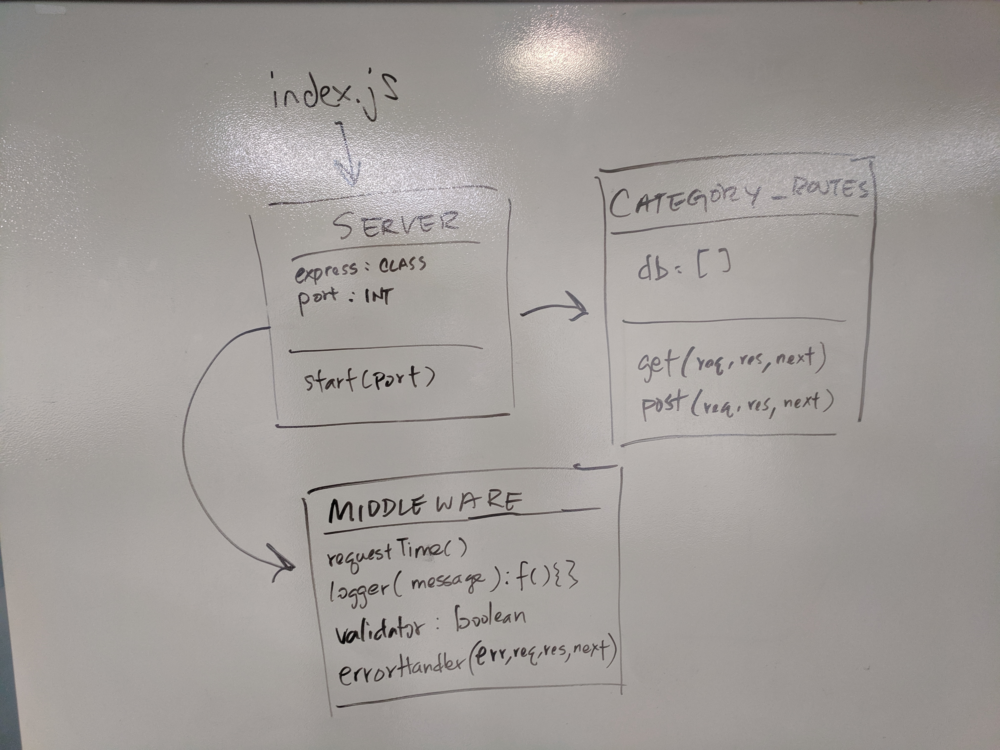

# LAB - 07

## Express

### Author: Austin Hedeen & Eric Huang

### Links and Resources
* [submission PR](https://github.com/austinhedeen-401-advanced-javascript/lab-07/pull/1)
* [travis](https://travis-ci.org/austinhedeen-401-advanced-javascript/lab-07/builds/574714527)
* [api-server](https://limitless-sierra-21853.herokuapp.com)

#### Documentation
* [api docs](https://app.swaggerhub.com/apis/Bejoty/lab-07/1.0.0)

### Modules
#### `server.js`
##### Exported Values and Methods

###### `server`
The Express application server

###### `start(port)`
A function to start the application server

#### Middleware
##### `404.js` - handles 404 status codes
##### `error.js` - handles 500 status codes
##### `logger.js` - logs route access by clients
##### `request-time.js` - attaches the system time to requests
##### `validator.js` - validates POST requests

### Setup
#### `.env` requirements
* `PORT` - Port Number

#### Running the app
* `npm run start`
* Endpoint: `/categories/`
  * GET: Returns an array of category objects
  * POST: Creates and returns a category object
  
#### Tests
* `npm run test`

#### UML

